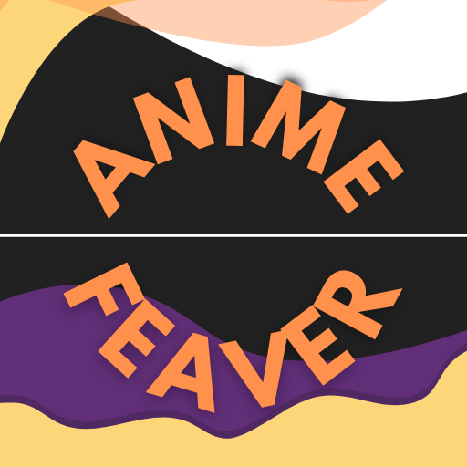
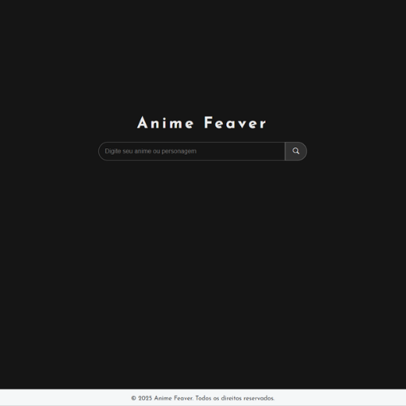
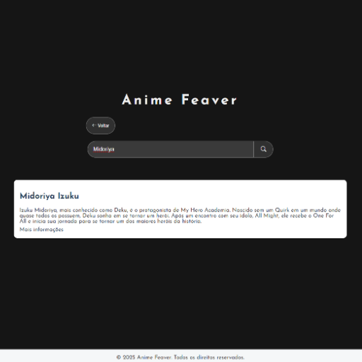
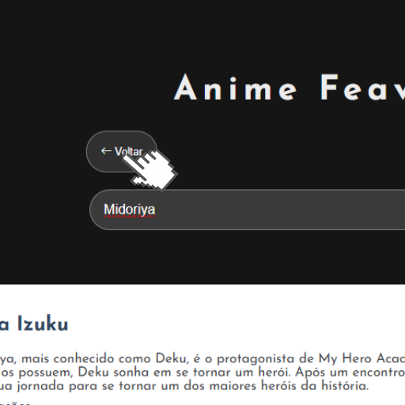

  

# Anime Feaver: Seu Guia Pessoal para o Mundo dos Animes

Já se pegou pensando **_`"Quem é aquele personagem maneiro que usa fogo?"`_** ou **_`"Qual anime tem aquele protagonista que não tem poderes"`_**?

**O Anime Feaver é o seu melhor amigo nessa jornada!**

### **O que a gente fez aqui?**

Criamos um site simples e divertido pra você encontrar tudo sobre seus animes favoritos. É tipo uma Wikipédia só dos animes, mas sem tanto texto chato.

## Como usar?

É fácil demais!

* **É assim que a página inicial se parece.**

  

---

* **Pesquise:** Digita o nome do personagem, anime ou qualquer palavra-chave que você lembrar na barra de pesquisa (no momento temos apenas três personagens pesquisáveis).

  

---

* **Botão voltar a página inicial:** Por questões estéticas e pelo nosso projeto, no momento, possuir uma única página, acrescentei um botão de **`<- Voltar`** para ter uma tela muito mais bonita quando quiser pesquisar outro personagem.

  

## O que tem por baixo dos panos?

* **HTML, CSS e JavaScript:** A base de tudo. A gente usou essas linguagens para criar a página e fazer ela funcionar.
* **Bootstrap Icons:** Deixamos tudo mais bonito com esses ícones legais.

## Quer ajudar a gente a deixar o Anime Feaver ainda mais incrível?

Manda um pull request! A gente adora novas ideias e contribuições. Você pode:

* **Adicionar mais animes e personagens:** Quanto mais, melhor!
* **Deixar o site mais bonito:** Use sua criatividade para criar um design incrível.
* **Adicionar novas funções:** Que tal um sistema de favoritos ou uma seção de notícias?

---

> [!NOTE]
> O projeto **`Anime Feaver`** ainda está em fase de desenvolvimento. Se você encontrar algum bug ou tiver alguma sugestão, por favor, me avise!

---

**Abaixo eu listei as futuras adições desse projeto:**

- [x] Melhorar o sistema de pesquisa.
- [x] Adicionar um botão de voltar para a tela inicial.
- [x] Adicionar uma documentação melhor.
- [ ] Melhorar o design do site.
- [ ] Criar sistemas de exibição de animes mais famosos com uso de API.
- [ ] Criar novas páginas de exibição usando React.js.
- [ ] Criar conexão com um banco de dados.

---

### **📑Licença:**

MIT (significa que você pode usar esse código como quiser, mas não pode nos processar se algo der errado.)

---

  
<b>Valeu por usar o Anime Feaver!</b>

  
<b>E aí, pronto para explorar o mundo dos animes com a gente?</b>

